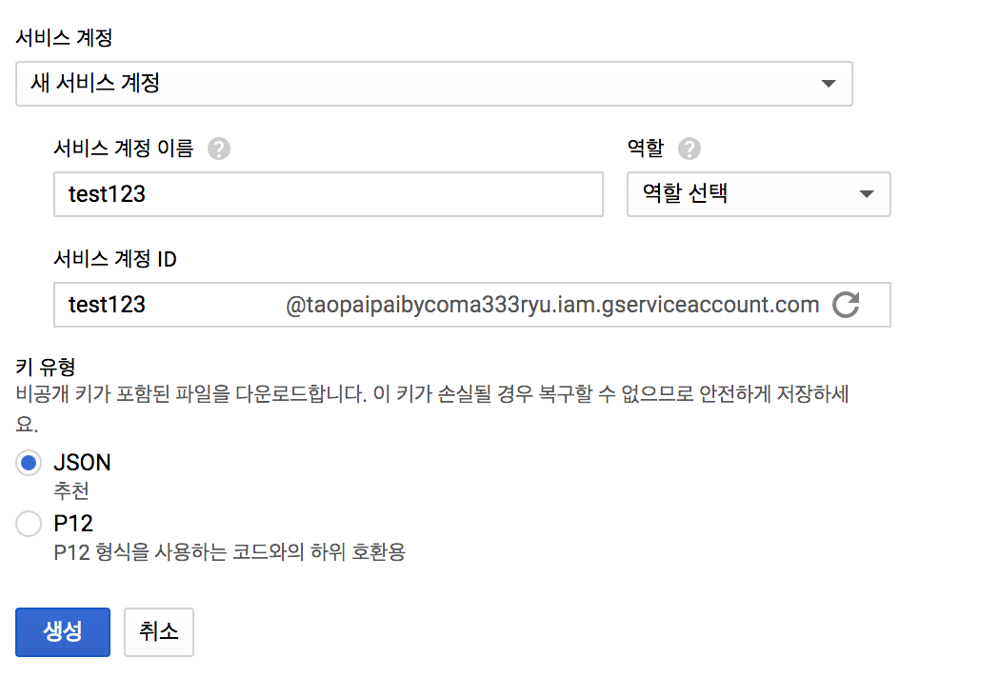
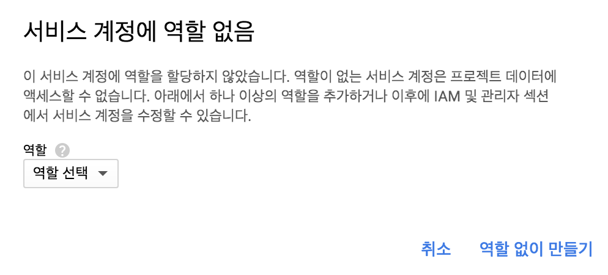

# TaopaipaibyComa333ryu

##  설정방법 정리
* ` https://cloud.google.com/vision/docs/libraries#client-libraries-install-go ` 요기 접속해서 각자 원하는 라이브러리 설치.
* 하단의 인증설정 따라하기
  * ` https://console.cloud.google.com/apis/credentials/serviceaccountkey?_ga=2.115105283.-569132826.1504865498&project=taopaipaibycoma333ryu&folder&organizationId ` 여기서 계정 생성 
    * 서비스 계정은 `새 서비스 계정 ` 선택
    * 계정이름 입력
    * 역활은 선택하지 않아야 함.
    * 키 유형은 json으로 선택
    
    * 생성버튼 클릭 후 ` 역활없이 만들기 ` 버튼 클릭해서 파일 다운로드 
    
  * 다운로드한 파일 적당한 위치로 이동
  * 하단의 환경변수 잡는 법으로 설정.
  * 샘플 소스 만들어 봄.
  * `https://cloud.google.com/vision/docs/before-you-begin` 로 이동 
  * 두번째 버튼 ` 결제사용설정방법 알아보기 ` 클릭
  * 결제 계정 생성하면 무료 평가판 으로 생성해 줌.(각자 알아서..)
  * 세번째 버튼으로 API 활성화 시킴.
  * 세번째 버튼 클릭하면 관리 페이지로 이동하게 되는데 왼쪽 메뉴에서 `결제` 메뉴 클릭.
  * 생성한 프로젝트와 결제 설정하면 기본설정 완료..ㅠㅠ